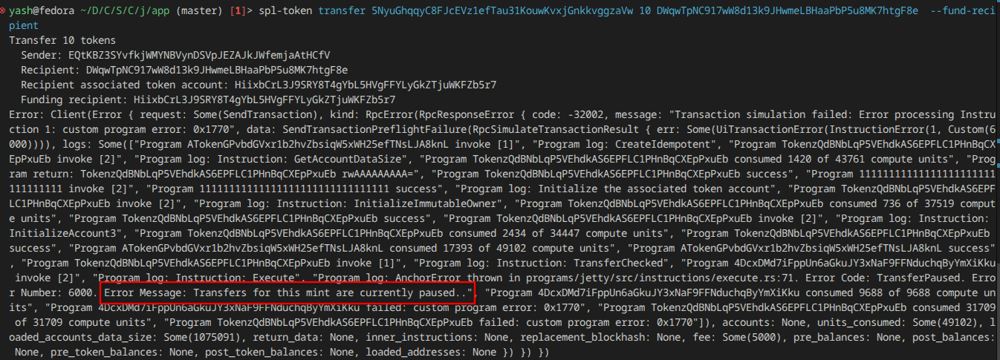
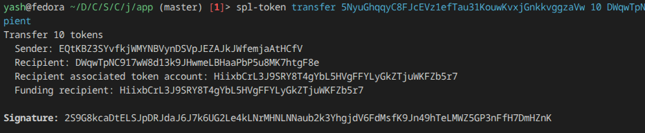

# Jetty

<p align="center">
  
  
  
  
  
  
</p>

**Live Demo**: [https://jetty-mu.vercel.app/](https://jetty-mu.vercel.app/)

> Universal on-chain compliance layer for SPL Token-2022 Transfer Hooks on Solana.

Jetty enables token issuers to enforce modular, on-chain compliance policies without writing a single line of custom Rust. Simply point your mint's Transfer Hook at the Jetty program, and configure your rules dynamically.

---

## Overview

Every SPL Token-2022 transfer is atomically intercepted by Jetty and evaluated against the issuer's active policy. Jetty provides three core compliance modules, each independently toggleable per mint:

| Module | Functionality |
|---|---|
| **Global Pause** | Freezes all token transfers across the entire mint. |
| **Volume Limit** | Rejects any transfer exceeding a configured `u64` threshold. |
| **Allowlist** | Restricts transfers exclusively to pre-approved sender and receiver wallets. |

**One deployed program. Infinite mints.** Each issuer retains absolute control over their own policy PDA, ensuring complete isolation and security by design.

---

## Project Structure

```text
programs/jetty/src/
├── lib.rs
├── error.rs
├── instructions/
│   ├── initialize_hook_config.rs       # Allocates the policy PDA for a mint
│   ├── init_extra_account_meta_list.rs # Registers required ExtraAccounts with Token-2022
│   ├── execute.rs                      # The core transfer hook invoked on every transaction
│   ├── update_policy.rs                # Modifies pause, volume limits, and allowlist toggles
│   ├── update_allowlist.rs             # Manages per-wallet allowlist entries
│   └── assign_policy_authority.rs      # Rotates the policy management authority
└── state/
    ├── hook_config.rs                  # HookConfig PDA: Stores policy flags and parameters
    └── allowlist.rs                    # AllowlistEntry PDA: Stores per-wallet approval status
```

### Protocol PDAs

| Account | Seeds | Purpose |
|---|---|---|
| `HookConfig` | `["policy", mint]` | Stores the global compliance rules for a specific mint. |
| `ExtraAccountMetaList` | `["extra-account-metas", mint]` | The standard Token-2022 PDA that dictates which accounts are forwarded to the hook. |
| `AllowlistEntry` | `["allowlist", mint, token_account]` | Represents a wallet's active allowlist status. |

### Execution Flow

```text
Transfer Triggered
      │
      ▼
Load HookConfig
      │
      ├─ Paused? ──────────────────────────► (Fail: TransferPaused)
      │
      ├─ Amount > Max Transfer Amount? ────► (Fail: ExceedsVolumeLimit)
      │
      └─ Allowlist Enabled?
              │
              ├─ Sender missing/inactive? ──► (Fail: SourceNotAllowlisted)
              │
              └─ Receiver missing/inactive? ─► (Fail: DestinationNotAllowlisted)
                        │
                        ▼
               (Success: Transfer Passes)
```

---

## Tech Stack

| Layer | Technologies Used |
|---|---|
| **Smart Contract** | Rust, Anchor Framework, SPL Token-2022 |
| **Testing** | TypeScript, Mocha, `@coral-xyz/anchor`, `@solana/spl-token` |
| **CI/CD** | GitHub Actions, `solana-test-validator` |

---

## Getting Started

### Prerequisites

Ensure you have the following modern Solana development tools installed:

```bash
anchor --version   # 0.30.1+
solana --version   # 1.18.x+ (Agave)
node --version     # 20.x+
yarn --version     # 1.22+
```

### Installation & Build

```bash
git clone https://github.com/yourusername/jetty
cd jetty
yarn install
anchor build
```

### Run the Test Suite

```bash
anchor test
```

---

## Integration Guide

### Devnet Deployment
- **Program ID**: `4DcxDMd7iFppUn6aGkuJY3xNaF9FFNduchqByYmXiKku`
- **Build Status**:
   

**Testing against Devnet:**  
To run the test suite against the deployed Devnet program, simply configure your `Anchor.toml` to `devnet` and skip the local validator:

```bash
anchor test --skip-local-validator
```

### 1. Initialize the Policy

After creating your Token-2022 mint and pointing its Transfer Hook extension at the Jetty Program ID, you must initialize its configuration PDA.

```ts
await program.methods
  .initializeHookConfig()
  .accounts({
    payer: wallet.publicKey,
    policyAuthority: wallet.publicKey,
    mint: mintPubkey,
  })
  .rpc();
```
*Note: This creates the `HookConfig` PDA with all compliance policies disabled by default.*

### 2. Register Extra Accounts

This critical step writes the `ExtraAccountMetaList` PDA required by the Token-2022 program. It ensures Token-2022 forwards the correct validation accounts to Jetty on every transfer.

```ts
await program.methods
  .initExtraAccountMetaList()
  .accounts({
    payer: wallet.publicKey,
    policyAuthority: wallet.publicKey,
    mint: mintPubkey,
    tokenProgram: TOKEN_2022_PROGRAM_ID,
  })
  .rpc();
```

### 3. Configure Your Rules

Policy fields are strictly typed as `Option<T>`. To update specific rules without modifying others, pass `null` for the fields you wish to leave unchanged.

```ts
// Example: Pause all transfers globally
await program.methods
  .updatePolicy({ 
    paused: true, 
    allowlistEnabled: null, 
    maxTransferAmount: null 
  })
  .accounts({ mint, policyAuthority, hookConfig })
  .rpc();

// Example: Enable the Allowlist and enforce a max transfer volume
await program.methods
  .updatePolicy({
    paused: false,
    allowlistEnabled: true,
    maxTransferAmount: new BN(1_000_000_000), // e.g., 1,000 tokens at 6 decimals
  })
  .accounts({ mint, policyAuthority, hookConfig })
  .rpc();
```

### 4. Manage the Allowlist

Add or remove users from your mint's allowlist in real-time.

```ts
// Approve a wallet's Token Account
await program.methods
  .updateAllowlist(true) // Pass `false` to revoke access
  .accounts({
    payer: wallet.publicKey,
    policyAuthority: wallet.publicKey,
    mint: mintPubkey,
    tokenAccount: userTokenAccountPubkey,
  })
  .rpc();
```

> **Tip:** Revoking a wallet (`active: false`) securely closes the `AllowlistEntry` PDA, purges it from the ledger, and refunds the rent to the payer. Re-approving the wallet later allocates a fresh PDA.

---

## Admin Dashboard

Jetty ships with a production-ready Next.js frontend to manage policies without using the CLI.

### Global Pause Enforcement




---

## Error Reference

| Error Code | Name | Trigger Condition |
|---|---|---|
| `6000` | `TransferPaused` | The mint's `HookConfig` is globally paused. |
| `6001` | `ExceedsVolumeLimit` | Transfer amount exceeds `max_transfer_amount`. |
| `6002` | `SourceNotAllowlisted` | The sender's token account lacks an active `AllowlistEntry`. |
| `6003` | `DestinationNotAllowlisted` | The receiver's token account lacks an active `AllowlistEntry`. |
| `6004` | `Unauthorized` | The instruction signer does not match the `policy_authority`. |
| `6005` | `NotTransferring` | The `execute` instruction was invoked directly without an active Token-2022 transfer. |

---

## Security & Architecture

- **Strict Transfer Verification**: The `execute` hook verifies the `transferring` flag on the source token account. Direct, malicious invocations of the hook are automatically rejected.
- **Role-Based Access Control**: Only the designated `policy_authority` can mutate compliance rules or allowlist states.
- **Authority Isolation**: The `policy_authority` can (and should) be isolated from the mint authority, allowing compliance teams to manage rules independently from token issuance.
- **Memory Safety**: The on-chain program contains zero `unsafe` blocks, zero unwraps (`unwrap()`/`expect()`), and zero heap allocations within the `execute` hot path to guarantee maximum throughput and safety.

### Roadmap

- [x] Global Pause
- [x] Volume Limits
- [x] On-Chain Allowlist
- [x] Anchor Tests & CI Pipeline
- [x] Devnet Deployment
- [x] Production Admin Dashboard (React/Next.js)
- [ ] On-chain audit logs via Anchor Events
- [ ] Off-chain KYC oracle integration
- [ ] Governance timelocks for program upgrades
- [ ] Security Audit

## License

MIT
